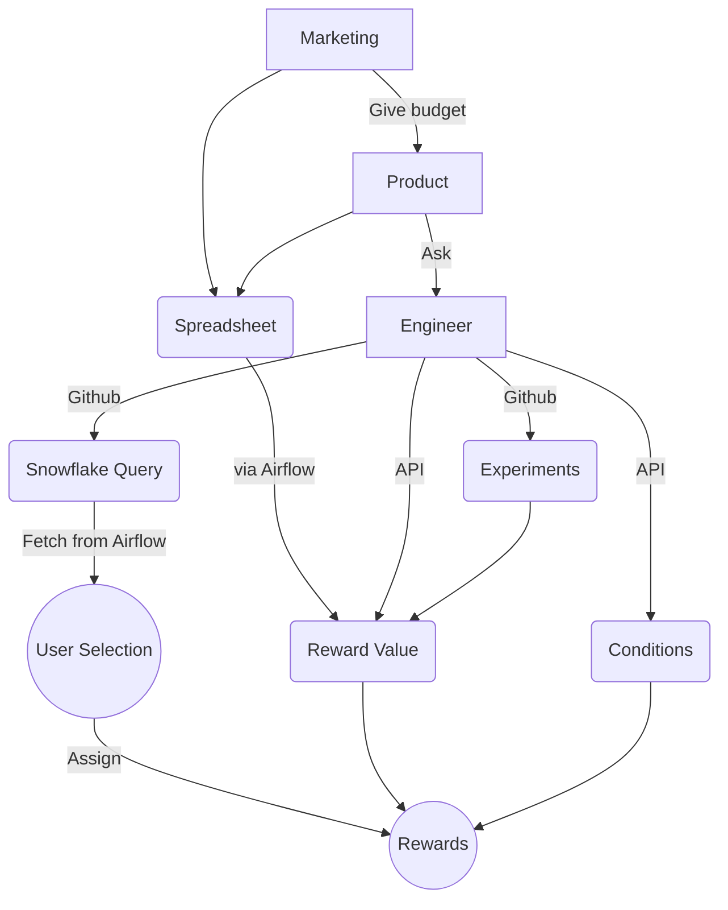
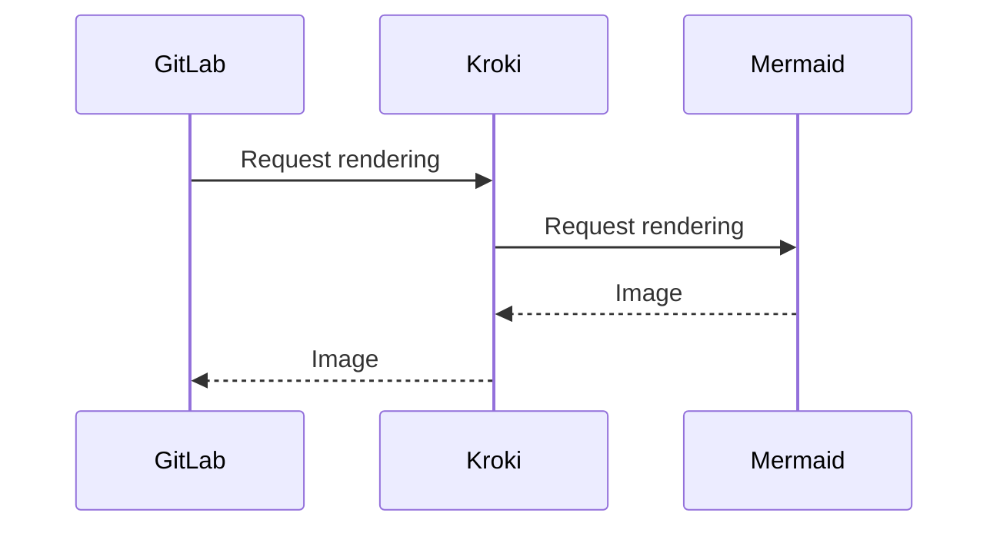

This is an example page that has a mermaid diagram. Just so you can see how it looks.



Yooo


# Customer Service  :computer:
Hola

Only mermaid



kroki mermai

```kroki-mermaid
sequenceDiagram
GitLab->>Kroki: Request rendering
Kroki->>Mermaid: Request rendering
Mermaid-->>Kroki: Image
Kroki-->>GitLab: Image
```
Plant uml

```kroki-plantuml
@startuml
left to right direction
skinparam packageStyle rectangle
skinparam monochrome true
actor customer
actor clerk
rectangle checkout {
  customer -- (checkout)
  (checkout) .> (payment) : include
  (help) .> (checkout) : extends
  (checkout) -- clerk
}
@enduml
```
