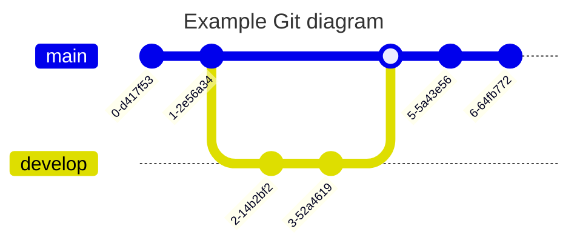

This is an example page that has a mermaid diagram. Just so you can see how it looks.



Doesnt support quadrant chart

```mermaid
flowchart LR
    id["This ❤ Unicode"]
```





```mermaid

---
title: Node
---
flowchart TD
    M[Marketing] -->|Give budget| P[Product]
    M --> S(Spreadsheet)
    S -->|via Airflow| A(Reward Value)
    P --> S
    E -->|API| A
    E -->|API| C(Conditions)
    P -->|Ask| E[Engineer]
    E -->|Github| X(Experiments)
    E -->|Github| G(Snowflake Query)
    G -->|Fetch from Airflow| U((User Selection))
    U -->|Assign| R((Rewards))
    A --> R
    C --> R
    X --> A
```
Because the required plugin is not installed, it will display the code instead of the diagram.
